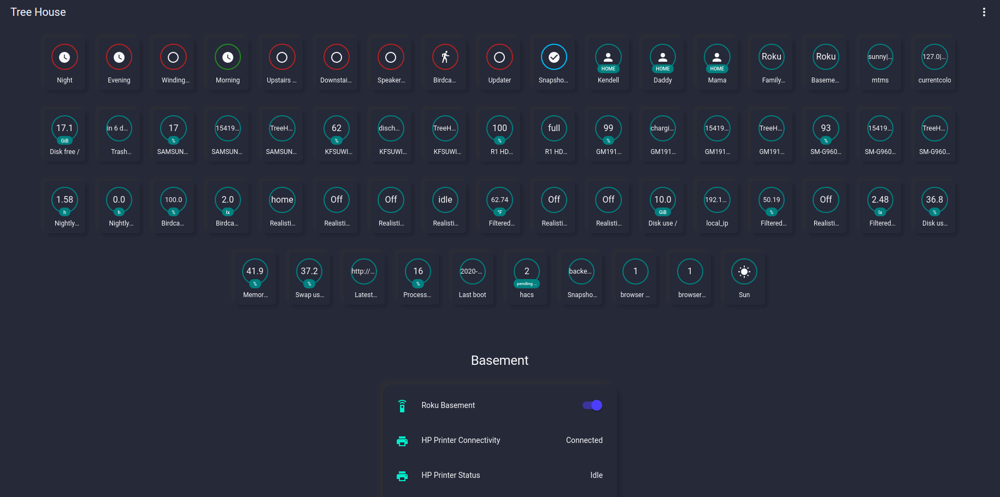

# Lovelace Soft UI dark theme
  
Home Assistant dark theme, built on from @JuanMTech, using style boilerplates from @thomasloven and @N-L1.
This theme depends on [`card-mod`](https://github.com/thomasloven/lovelace-card-mod) for the soft-ui styling.
## Screenshot

*Note: I've changed the theme so the header's background is black instead of purple since this screenshot was taken.*
